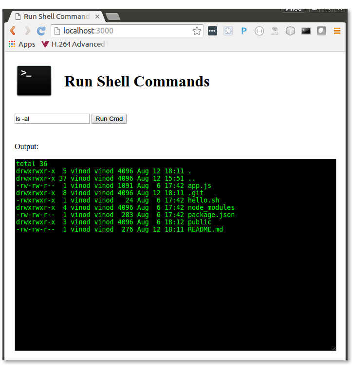

# node-bash
Run shell scripts in browser using node.js

# How to use
clone the repository

cd to node-bash

run 'npm install'

run 'node app.js'

Point the browser to localhost:3000

Run shell commands in the browser

# Possible uses
Create front end web UI for shell scripts

